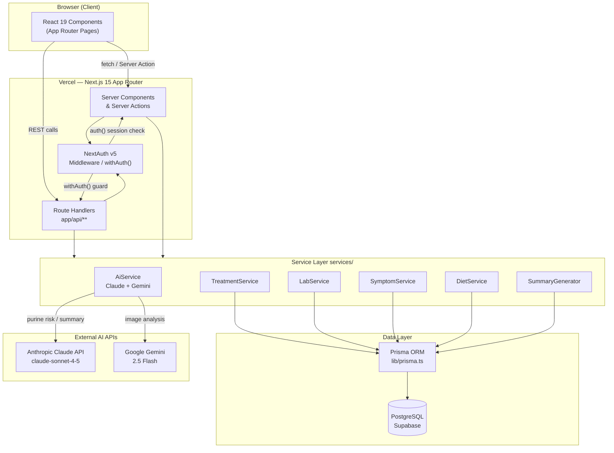

# ChronicPal — AI-Powered Chronic Treatment Companion

> CS 7980 — AI-Assisted Coding (Spring 2026) · Northeastern University

**ChronicPal** helps patients undergoing recurring therapies (e.g., gout infusion treatments) track treatments, lab results, symptoms, and diet between clinic visits. It generates AI-powered pre-visit summaries, flags dietary risks in real time, and gives caregivers read-only visibility into patient progress.

**Live Demo**: [https://chronicpal.vercel.app](https://chronicpal.vercel.app)

**Team**: Shuhan Dong · Lang Min ([@LangMinNEU](https://github.com/LangMinNEU))

---

## Table of Contents

- [Features](#features)
- [Tech Stack](#tech-stack)
- [Architecture](#architecture)
- [Project Structure](#project-structure)
- [Getting Started](#getting-started)
- [API Reference](#api-reference)
- [Claude Code Mastery](#claude-code-mastery)
- [Testing](#testing)
- [CI/CD Pipeline](#cicd-pipeline)
- [Security](#security)
- [Architecture Decisions](#architecture-decisions)
- [Individual Reflection — Shuhan Dong](#individual-reflection--shuhan-dong--个人反思--董书涵)

---

## Features

### Patient Dashboard
- **Treatment Logging** — Log infusion sessions, medications, uric acid levels (mg/dL), and pain scores (0–10) with trend charts over configurable time windows (1mo / 3mo / 6mo / 1yr)
- **Lab Tracking** — Record and visualize lab results with historical trend analysis
- **Symptom Monitoring** — Track daily symptom entries and spot flare-up patterns over time
- **AI Diet Analysis** — Input meals by text or image; receive instant purine-risk scores (low / moderate / high / very high) powered by Claude and Gemini
- **Pre-Visit Summary** — One-click AI-generated doctor report covering lab trends, symptom trajectory, diet compliance, and flagged concerns

### Caregiver Dashboard
- Link via share code for read-only access to a patient's treatment adherence and diet compliance
- No separate caregiver account required — link-based access with role enforcement at the DB level

---

## Tech Stack

| Layer | Choice |
|-------|--------|
| Framework | Next.js 16 (App Router), React 19, TypeScript 5 |
| Styling | Tailwind CSS 4, PostCSS |
| Auth | NextAuth v5 (Credentials provider, JWT in httpOnly cookies) |
| Database | PostgreSQL (Supabase), Prisma ORM 6 |
| AI | Anthropic Claude API (`claude-sonnet-4-5`) + Google Gemini 2.5 Flash — server-side only |
| Logging | Winston 3 (structured, PHI-safe field allowlist) |
| Testing | Vitest 3 + React Testing Library + Playwright; coverage ≥ 70% |
| Tooling | ESLint, Prettier (2-space, single quotes, trailing commas), Husky |
| Deployment | Vercel (preview on PR, production on merge to main) |

---

## Architecture



---

## Project Structure

```
CS7980_ChronicPal_Treatment_Companion/
├── chronicpal/                  # Main Next.js application
│   ├── app/                     # App Router — pages & Route Handlers
│   │   ├── api/                 # REST endpoints (treatments, labs, diet, auth…)
│   │   ├── dashboard/           # Patient dashboard pages
│   │   ├── caregiver/           # Caregiver dashboard
│   │   ├── login/               # Auth pages
│   │   └── register/
│   ├── services/                # Business logic & AI integration
│   │   └── prompts/             # Claude prompt templates
│   ├── validators/              # Zod schemas for all inputs
│   ├── lib/                     # Prisma singleton, auth guard, constants
│   ├── components/              # Shared React components
│   ├── __tests__/               # Vitest unit & integration tests (31 files)
│   ├── e2e/                     # Playwright E2E tests
│   ├── prisma/                  # Schema & migrations
│   └── .claude/                 # Claude Code project settings & hooks
├── .claude/                     # Claude Code skills & agents (repo-level)
│   ├── skills/                  # Custom slash commands
│   └── agents/                  # Sub-agent definitions
├── docs/                        # PRD, ADRs, domain glossary, issue specs
├── ScreenShot/                  # Claude Code usage evidence (MCP, skills, agents)
├── session-log.md               # Development session log
└── CLAUDE.md                    # Claude Code context with @imports
```

---

## Getting Started

### Prerequisites

- Node.js 20+
- PostgreSQL database (or Supabase project)
- Anthropic API key
- Google Gemini API key

### Setup

```bash
# 1. Clone the repo
git clone https://github.com/hansama0902/CS7980_ChronicPal_Treatment_Companion.git
cd CS7980_ChronicPal_Treatment_Companion/chronicpal

# 2. Install dependencies
npm install

# 3. Configure environment variables
cp .env.example .env
# Fill in: DATABASE_URL, AUTH_SECRET, ANTHROPIC_API_KEY, GOOGLE_GENERATIVE_AI_API_KEY

# 4. Run database migrations & generate Prisma client
npx prisma migrate dev
npx prisma generate

# 5. Start the dev server
npm run dev
# → http://localhost:3000
```

### Environment Variables

| Variable | Description |
|----------|-------------|
| `DATABASE_URL` | PostgreSQL connection string (Supabase) |
| `AUTH_SECRET` | NextAuth secret (≥ 32 chars) |
| `ANTHROPIC_API_KEY` | Anthropic Claude API key |
| `GOOGLE_GENERATIVE_AI_API_KEY` | Google Gemini API key |
| `NEXTAUTH_URL` | App base URL (e.g., `http://localhost:3000`) |

### Common Commands

```bash
npm run dev               # Dev server (localhost:3000)
npm run build             # Production build
npm run test              # Vitest unit/integration (watch)
npm run test:run          # Vitest single run
npm run test:e2e          # Playwright E2E
npm run lint              # ESLint
npm run typecheck         # tsc --noEmit
npm run format            # Prettier write

npx prisma migrate dev    # Apply migrations (dev)
npx prisma studio         # DB GUI
```

---

## API Reference

All endpoints are Next.js Route Handlers under `app/api/`. Every protected endpoint is wrapped with `withAuth()` from `lib/routeAuth.ts`. All inputs are validated with Zod before reaching the database.

| Method | Path | Auth | Description |
|--------|------|------|-------------|
| POST | `/api/auth/register` | Public | User registration |
| POST | `/api/auth/[...nextauth]` | Public | NextAuth sign-in / sign-out |
| GET / POST | `/api/treatments` | Patient | List / create treatment entries |
| PUT / DELETE | `/api/treatments/[id]` | Patient | Update / delete treatment entry |
| GET / POST | `/api/labs` | Patient | List / log lab results |
| DELETE | `/api/labs/[id]` | Patient | Delete lab result |
| GET / POST | `/api/symptoms` | Patient | List / log symptom entries |
| DELETE | `/api/symptoms/[id]` | Patient | Delete symptom entry |
| GET / POST | `/api/diet` | Patient | List / log meal with AI analysis |
| POST | `/api/diet/analyze` | Patient | AI purine-risk analysis (Claude) |
| GET | `/api/summary` | Patient | Generate AI pre-visit summary |
| POST | `/api/caregiver/link` | Patient | Generate caregiver share code |
| GET | `/api/patient/links` | Patient | List active caregiver links |

---

## Claude Code Mastery

This project demonstrates all required Claude Code concepts from CS 7980.

### CLAUDE.md & Memory

`CLAUDE.md` at the repo root uses `@import` for modular organization:
- `@import docs/PRD.md` — Product requirements & user stories
- `@import docs/ADRs.md` — Architecture Decision Records
- `@import docs/domain-glossary.md` — Domain terminology

CLAUDE.md evolution is visible in git history — it was updated across 4+ commits as the project migrated from React/Vite + Express to Next.js full-stack and as new security/testing conventions were added.

### Custom Skills (6)

Located in `.claude/skills/`:

| Skill | Version | Description |
|-------|---------|-------------|
| `/add-feature` | v2 | Scaffold backend feature end-to-end: Prisma schema → Zod validator → service → Route Handler → Vitest tests. v2 added Step 0 to block features that reference missing Prisma models. |
| `/review` | v2 | ChronicPal-specific code review: PHI safety, auth patterns, AI boundaries, DB access. v2 added REST design checks (Category 9). |
| `/commit-to-branch` | v1 | Git workflow helper — stage, commit, and push to feature branch. |
| `/explain-code` | v1 | Code explanation with visual diagrams and analogies. |
| `/explain-skill` | v1 | Documents a skill's behavior and options. |
| `/update-repo` | v1 | Pull latest main and rebase current branch. |

### Hooks (2)

Configured in `chronicpal/.claude/settings.json`:

1. **PostToolUse Hook** — Triggers after every `Edit` or `Write` tool call; auto-runs `npx prettier --write` on TypeScript files to enforce consistent formatting.
2. **Stop Hook** — Triggers when Claude finishes a session; auto-runs `npm run test:run | tail -30` to display a test summary without requiring a manual command.

Additionally, a Husky **pre-commit hook** runs `gitleaks protect --staged` to block secrets from being committed.

### MCP Servers (1)

Configured in `.mcp.json`:

| Server | Purpose |
|--------|---------|
| `figma-remote-mcp` | Design collaboration — read Figma component specs directly inside Claude Code sessions |

Usage evidence: `ScreenShot/mcp 1.png` through `mcp 7.png` (April 17) showing MCP server startup and Figma integration in action.

### Agents (2)

Located in `.claude/agents/`:

| Agent | Invocation | Purpose |
|-------|------------|---------|
| `security-reviewer` | `security-reviewer: review <file or diff>` | Reviews code for P0/P1/P2 security violations — PHI leakage, auth patterns, injection risks, OWASP Top 10 |
| `test-writer` | `test-writer: write tests for <feature>` | Writes Vitest unit/integration tests and Playwright E2E tests following TDD red-green-refactor workflow |

### Parallel Development

Feature branches demonstrate parallel development across the team:

```
feature/CP-1                      feature/cp-8-ai-meal-analysis
feature/CP-9-diet-analysis         feature/cp-6-treatment-logging-ui
feature/cp-10-pre-visit-summary    feature/cp-4-cp-11-auth-caregiver
feature/CP-7-CP-14-labs-dashboard  feature/cp-symptoms-treatment-logging
```

### Writer / Reviewer Pattern

All PRs follow the writer/reviewer pattern:
- One developer writes the feature (or uses Claude Code to scaffold it via `/add-feature`)
- A second review pass uses `security-reviewer` agent and the CI `ai-review` job (Claude Code Action) with the C.L.E.A.R. framework
- PRs include AI disclosure metadata: % AI-generated, tool used (Claude Code), human review applied

---

## Testing

```bash
npm run test:run          # All unit & integration tests
npm run test:run -- --coverage   # With coverage report
npm run test:e2e          # Playwright E2E tests
```

### Coverage

- **31 test files** across `__tests__/` (unit + integration)
- **2 E2E spec files** in `e2e/` (`auth.spec.ts`, `critical-flow.spec.ts`)
- **Coverage threshold**: lines ≥ 70%, functions ≥ 70%, branches ≥ 70% (enforced in CI)

### TDD Workflow

Git history shows the red-green-refactor pattern:

```
2c5645d [CP-9] test: add failing tests for diet analysis   ← red phase
ca8a727 [CP-9] feat: implement AI diet analysis            ← green phase
30da8f6 Fix prettier                                        ← refactor
```

---

## CI/CD Pipeline

GitHub Actions workflow (`.github/workflows/ci.yml`) runs on every PR and push to `main`:

```
lint → typecheck → unit-test ─┐
security ──────────────────────┤→ e2e → deploy-preview (PR)
                               │       deploy-production (main)
ai-review (parallel) ──────────┘
```

| Job | What it runs |
|-----|--------------|
| **lint** | ESLint + Prettier check |
| **typecheck** | `tsc --noEmit` |
| **unit-test** | Vitest + coverage threshold |
| **security** | `npm audit --audit-level=high` · Gitleaks · Semgrep (`p/typescript`, `p/nodejs`, `p/owasp-top-ten`) |
| **ai-review** | Claude Code Action — PHI safety, auth patterns, Zod validation, CLEAR framework |
| **e2e** | Playwright on Chromium with real Postgres service container |
| **deploy-preview** | Vercel preview deploy (PR only) |
| **deploy-production** | Vercel production deploy (merge to `main` only) |

---

## Security

This project implements a multi-layer security pipeline aligned with OWASP Top 10 (2021):

| Gate | Tool | When |
|------|------|------|
| Secrets detection | Gitleaks (`protect --staged`) | Pre-commit |
| Dependency audit | `npm audit --audit-level=high` | CI |
| SAST | Semgrep `p/owasp-top-ten` | CI |
| AI security review | Claude Code Action + `security-reviewer` agent | CI + PR |

**Key mitigations:**
- **PHI Safety** — Winston structured logger with explicit field allowlist; health data never appears in logs, error messages, or client responses
- **Auth** — NextAuth v5 JWT in httpOnly cookies; no localStorage tokens; bcryptjs password hashing
- **Injection** — Prisma ORM parameterized queries; all inputs validated with Zod before DB access
- **AI boundary** — All Claude/Gemini API calls are server-side only (Route Handlers); no AI calls from Client Components

---

## Architecture Decisions

| ADR | Decision | Rationale |
|-----|----------|-----------|
| ADR-2 | Prisma over raw SQL | Type-safe access, auto-generated migrations, clear schema file |
| ADR-3 | JWT auth (httpOnly cookies) | Stateless, no sticky sessions; tokens never in localStorage |
| ADR-4 | Claude API for AI features | Best-in-class for clinical narrative generation and dietary risk analysis |
| ADR-5 | Supabase as managed Postgres | Managed connection pooling; Prisma as the sole ORM layer (no Supabase SDK) |
| ADR-6 | No PHI in logs | Health data must never appear in `console.log`, error messages, or third-party services |

---

## Project Deliverables

| Deliverable | Link |
|-------------|------|
| Slide Deck | [Google Slides](https://docs.google.com/presentation/d/1bE2UHOsf4Y77ce3D_uPG-ac-M_0TN9Bu3LtzYe1b_kE/edit?usp=sharing) |
| Demo Video | [YouTube](https://youtu.be/cQoulHRlD18) |
| Technical Blog Post | [LinkedIn Article](https://www.linkedin.com/posts/shuhan-dong-aa2041233_how-claude-code-shipped-a-health-tech-app-ugcPost-7452546542517010432-BK7e?utm_source=share&utm_medium=member_desktop&rcm=ACoAADo0QNoBGrOlvQt-S7bs8ApRYL9oApcG-rk) |
| Live Production App | [chronicpal.vercel.app](https://chronicpal.vercel.app) |

---

## License

MIT — see [LICENSE](LICENSE).
